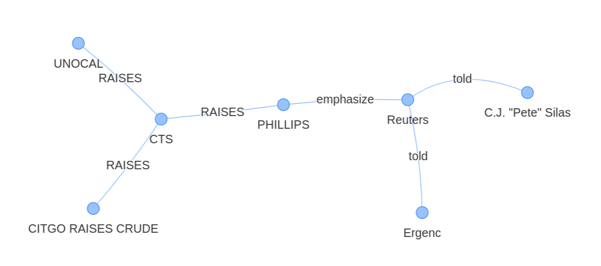

# Analyzing the relationships between entities in text using NLP and knowledge graphs

## Project description

The project is aimed at implementing available NLP libraries to find out relationships between entities in a text document and to visualize the relationships using Knowledge graphs. Nodes represent entities such as persons, places, events, or companies, and edges represent formalized relations between those nodes. For this project, the publicly available Reuters dataset from the NLTK library, specifically the catagory `Crude`was used. 

## Mission objectives

The objectives are consolidate the knowlege in NLP, specifically in :

- Be able to preprocess data obtained from textual sources
- Be able to employ named entity recognition and relationship extraction using SpaCy
- Be able to visualize results
- Be able to present insights and findings to client
- Be able to store data using the graph database Neo4j
- Be able to write clean and documented code.

## The Mission

A manager at a consultancy agency has been overrun by an influx of projects that involve large volumes of financial news. He hands you piles and piles of documents and asks you to read each one and provide a summary of: 

* Who is implicated in this document? and what are their relationships?*

### Must-have features

- A pipeline that takes a document and applies named entity recognition (NER) and relationship extraction of those entities
- A visualization of the entities within the text and their relationships in a network
- A validation strategy for your results

### Nice-to-have features

- Create a graphdata base to store your modeling results using Neo4j.
- Create an app and deploy it using Docker.

## Main Libraries used
- SpaCY
- NeuralCoref (from Hugging Face)

## Discussion

The following features are achieved.

 1. A pipeline that takes a document and applies named entity recognition (NER) and relationship extraction of those entities is implemented
 2. A visualization of the entities within the text and their relationships in a network in `Jaal`
 3. A custom NER model was developed and trained by scraping data from the gived dataset and wikipedia and was able to recognize more companies related to Crude catagory than the pretrained model from spaCy. 

## Installation and Usage

The environment at which the code is developed is provided in the `requirements_main.txt` file. To run the code, the necessary libraries should be installed  based on that environment.

To run the code, you need tot open and run the file `main.py'. 

## A validation strategy for your results 
The validation strategy we followed is to look back at the text and collect the entities and their relationships manually and compare it to what the code delivers. It is notcied that most of the entities  and their relationships are recognized with some exceptions. 

Some of the limitations are:
    
  * In some cases named entities were extracted but their types were wrong. PERSON entities were recognised as ORG entities or viceversa. This could be solved by implementing `Entity Linking` to a knowledge base. Entity linking was not implemented in this project.
  * Some other entities were not recognized at all. It was attempted to improve this by training a custom NER model from a knowlege base.

## Further Development
To make the work more complete, it would be good to have  the Nice to have features included.

  * Implementation of Neo4j
  * Deployment

## Personal situation

The contributers to this project are:

- Margaux Benoit  
- Mekonnen Gebrehiwot and 
- Sebastian Chaves